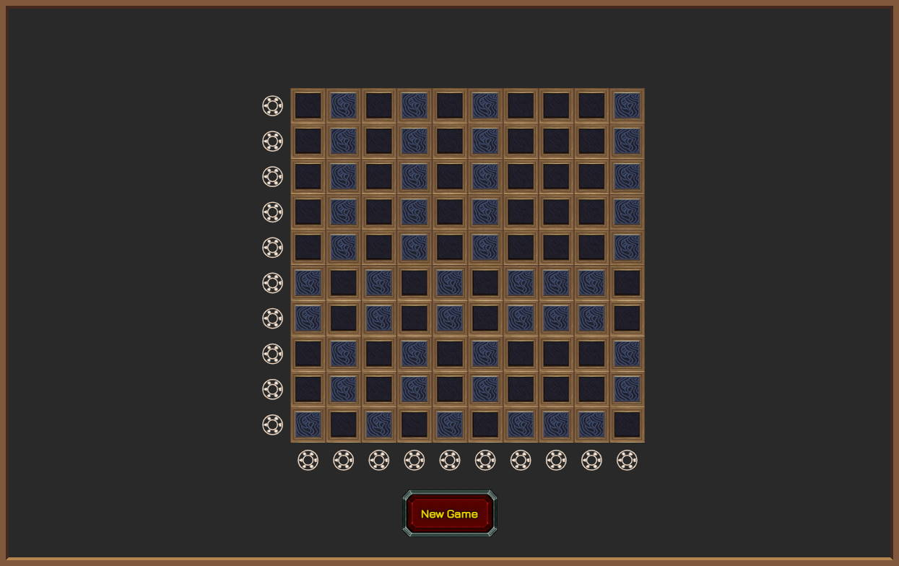

# Cantaric Protolock
Cantaric Protolock is a puzzle game from World of Warcraft patch 9.2.

Remade in pure JavaScript.

The Goal of this game is to "turn off" all squares by inverting either vertical or horizontal lines.

Live version can be found on [itch.io](https://ginpachi987.itch.io/cantaric-protolock) and [yoro.dev](https://games.yoro.dev/cantaric/).

## Commands
### Installation
    npm install
    npm run dev

### Build
    npm run build